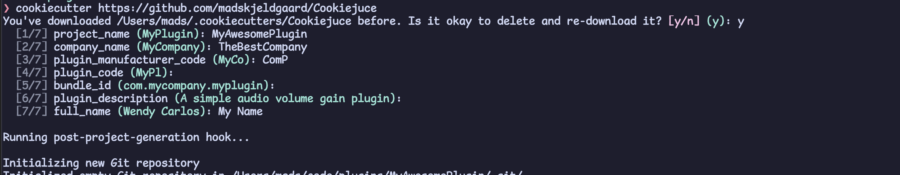

[](https://ko-fi.com/X8X6RXV10)

# Cookiejuce – A command line tool for generating modern JUCE projects with CMake

 

Easily generate beautiful JUCE projects and create audio, midi and music software with modern C++ using a simple command line tool interface.

When run, you are asked a series of questions, and a new project is generated based on your answers with everything correctly set up and named for your project.

Features:
- Uses [JUCE v7](https://github.com/juce-framework/JUCE)
- Has a nice starting point for your project including optional guis, parameters, etc. 
- Projects generated [using cookiecutter](https://cookiecutter.readthedocs.io/en/stable/)
- CMake based JUCE workflow
- Supports C++20
- Support for [the CLAP format](https://u-he.com/community/clap/), as well as the expected VST3, AU, AAX and Standalone formats.
- [vscode](https://code.visualstudio.com/docs/editor/tasks) / [neovim overseer](https://github.com/stevearc/overseer.nvim) tasks are automatically generated. Making it very simple to configure, build and run your project from your editor.
- [CPM](https://github.com/cpm-cmake/CPM.cmake) for dependency management
- Based on the Pamplejuce template, see [the original Pamplejuce readme for info about what it includes](PAMPLEJUCE_README.md):
    - Github action to automatically do cross platform builds and tests
    - Has Catch2 v3.4.0 for the test framework and runner.
    - Includes a Tests target and a Benchmarks target some examples to get started quickly.
    - Has [Melatonin Inspector](https://github.com/sudara/melatonin_inspector) installed as a JUCE module to help relieve headaches when building plugin UI.

The pamplejuce team has [nice explanation about using cmake and juce together](https://melatonin.dev/blog/how-to-use-cmake-with-juce/).

## Installation

> [!NOTE]
> You need Python3 to run this tool.

It is required to have `cookiecutter` installed. You can install it with pip:

```bash
pip install cookiecutter
```
## Usage

Run the following command to generate a new project:

```bash
cookiecutter https://github.com/madskjeldgaard/Cookiejuce
```

You will be asked a series of questions about your project:
- Project name
- Company name
- Plugin manufacturer code – this is auto generated from previous answers but you can overwrite it
- Plugin code - this is auto generated from previous answers but you can overwrite it
- Bundle ID - this is auto generated from previous answers but you can overwrite it
- Plugin description
- Type – Choose between instrument, audio effect and midi effect. This will set both the CLAP part of your project with the correct features and the "normal" JUCE part of your project as well.
- Use generic GUI: Setting this to true will use the generic JUCE GUI instead of your custom GUI. This will automatically show all defined parameters of your plugin as sliders, labels, drop downs etc.
- Add defualt parameters: This sets up the proper methods, class inheritance and member variables for your plugin to have a set of default parameters to work from. 
- Needs midi input
- Needs midi output

After answering these questions, Cookiejuce will git clone all submodules needed for your project and automatically populate your CMakelists.txt, set up all files correctly, make .vscode runner scripts, etc. All with the correct names and settings for your project.
In other words: You can immediately build and use your plugin. 

## Credits

This project was originally based on [Pamplejuce](https://github.com/sudara/pamplejuce), a super nice template for creating nice JUCE projects.

